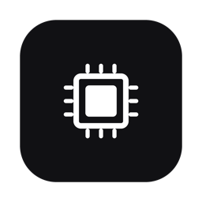

<p align="center">
  
</p>

<h1 align="center">Local Models</h1>

<p align="center"><strong>One local daemon that serves a fleet of small models to every app.</strong></p>

<p align="center">
  
  
  
  
</p>

Local Models is a localhost daemon, two CLIs and a menu-bar app for running
many small on-device models on one Mac. It is for people who run several
local-AI apps and do not want each one to load its own copy of a model. The
daemon owns the registry, the weights, the loading and the memory; apps make a
localhost call.

> **Free and open source.** Local Models is free to use, change and share under the MIT License.
> No account, no subscription, no telemetry. Model calls stay on your Mac; the only network traffic is the Hugging Face download you start with `local-model pull`.

## Features

### Why one daemon

The future of local AI on a personal machine does not look like one big model.
It looks like many small ones: a 2B vision model, an OCR pass, a dictation
model, a completion model for ghost text, an extraction model that only ever
returns schema-valid JSON. Each is excellent at one narrow job, cheap enough to
keep warm, and private by construction.

The problem is that every app then embeds its own runtime, loads its own copy,
and burns its own RAM. Five local-AI apps become five model stacks.

Local Models inverts that: **one registry, one daemon, warm models, thin
clients.** Apps make a localhost call; the daemon owns the weights, the loading,
and the memory. Adding a sixth app costs a client call, not a model integration.

```
┌─────────────┐ ┌─────────────┐ ┌─────────────┐ ┌─────────────┐
│  launcher   │ │ autocomplete│ │ screen ctx  │ │ agent/CLI   │   thin clients
└──────┬──────┘ └──────┬──────┘ └──────┬──────┘ └──────┬──────┘
       └───────────────┴───────┬───────┴───────────────┘
                       127.0.0.1:8078  (never the network)
                    ┌───────────┴───────────┐
                    │   local-models daemon │  warm models, one copy
                    │  vision · completion  │
                    │     transcription*    │
                    └───────────┬───────────┘
                        ~/Models/ registry + weights
```

\* Transcription is phase 2: its endpoint exists and returns an honest 501
until then. Completion serves (daemon-managed llama-server). Dictation apps
that need the lowest latency can keep their models in process and share only
the `~/Models/` weight store; [Local Dictation](https://github.com/tristan-mcinnis/local-dictation)
does this by design.

### What you get

- **One registry** at `~/Models/models.json`. Apps ask for a model id, an alias
  or a capability, never a file path.
- **`local-model pull`**: one command from a Hugging Face repo to a model every
  app can call. It infers the backend (MLX snapshot or GGUF file), sizes it and
  writes the registry entry. A running daemon picks it up with no restart.
- **Vision and text** through mlx-vlm, **completion** through a daemon-managed
  llama.cpp `llama-server`, **transcription** planned (honest 501 today).
- **An OpenAI-compatible passthrough** (`/v1/chat/completions`,
  `/v1/openai/models`), so any OpenAI SDK can point at the daemon and name a
  registry id.
- **`local-image`**: OCR (Apple Vision or Tesseract), describe, UI inventory,
  and schema-validated JSON extraction from an image, on device.
- **Idle unloading**: a model nobody has used for 30 minutes is unloaded, so a
  forgotten warm model stops holding gigabytes of RAM.
- **A menu-bar app** that shows which models are warm and loads or unloads them.
- **A small Swift client** for native apps.

### Design rules

- **Local socket only.** The daemon binds 127.0.0.1. Nothing listens on the network.
- **Warm beats fast-loading.** RAM spent on one shared warm copy beats every app cold-starting its own.
- **The registry is the contract.** Apps ask for capabilities and aliases, never file paths.
- **Honest 501s.** A capability that is planned but not served refuses loudly instead of pretending.
- **Weights out of git.** `~/Models/` holds the artifacts; this repo holds everything that manages them.

## Requirements

- A Mac with Apple Silicon. The vision backend uses [MLX](https://github.com/ml-explore/mlx),
  which runs only on Apple Silicon.
- macOS 14 or later for the menu-bar app (macOS 13 or later for the Swift client).
- Python 3.11 or later with the packages in [requirements.txt](requirements.txt):
  [mlx-vlm](https://github.com/Blaizzy/mlx-vlm) for the vision backend,
  `huggingface_hub` for `pull`, `jsonschema` for `local-image extract`, and
  PyObjC for Apple Vision OCR (without it, OCR falls back to Tesseract).
- [llama.cpp](https://github.com/ggml-org/llama.cpp) (`brew install llama.cpp`)
  for GGUF completion models. Optional: Tesseract (`brew install tesseract`).
- A Swift 5.10 toolchain (Xcode 15.3 or later) to build the menu-bar app from
  source. The downloaded DMG does not need it.
- Disk space and RAM for the models you pull. A 2B vision model at 4 bits is
  about 1.8 GB on disk.

The CLIs run under the first `python3` on PATH (`#!/usr/bin/env python3`), not
the daemon's interpreter, so that `python3` needs these packages too. A conda
or Homebrew `python3` ahead of the one with mlx-vlm makes `pull` fail with
"huggingface_hub is required" and OCR fall back to Tesseract.

## Install

### Download

Get the menu-bar app from the
[latest release](https://github.com/tristan-mcinnis/local-models/releases/latest):
`LocalModels-<version>-macos-arm64.dmg` (Apple Silicon, macOS 14 or later).

The DMG holds only the menu-bar app. The daemon is Python and installs from
source, as shown in "Build from source and install" below. Until you install
the daemon, the app shows it as unreachable.

#### First open

The app is not notarized. It is a free project and has no paid Apple Developer ID, so macOS blocks the first open. This is expected. To open it:

1. Drag the app to Applications.
2. Open it once. macOS says it cannot verify the app. Click Done.
3. Open System Settings > Privacy & Security. Scroll down and click Open Anyway. Confirm.

Or, in Terminal:

```bash
xattr -dr com.apple.quarantine "/Applications/Local Models.app"
```

Each release is signed ad hoc. After an update, macOS may ask again for permissions such as Accessibility or Microphone.

Check the download against `SHA256SUMS` on the release page:

```bash
shasum -a 256 -c SHA256SUMS
```

### Build from source and install

The daemon and the CLIs always install this way.

```bash
git clone https://github.com/tristan-mcinnis/local-models.git
cd local-models
python3 -m pip install -r requirements.txt
make install          # copies cli/ + server/ to ~/.local/lib/local-models,
                      # links local-model + local-image onto ~/.local/bin, and
                      # seeds ~/Models/models.json from the example if absent
make install-server   # launchd agent for the daemon (port 8078); the CLIs need it
```

`make install-server` renders `server/launchd/com.local-models.server.plist.template`
into `~/Library/LaunchAgents` with the `python3` it finds on PATH. Pass
`PYTHON=/path/to/python3` to pick the interpreter that has mlx-vlm. Logs go to
`~/Library/Logs/local-models.log`. Rerun `make install` after every change to
`cli/` or `server/`, then `make restart`.

`make uninstall` removes the CLIs, the installed copy, the launchd agent and
the menu-bar app. It leaves `~/Models/` alone.

Names: the repository is `local-models`; the CLIs are `local-model` and
`local-image`; the daemon's launchd job is `com.local-models.server` on port
8078; the menu-bar app is "Local Models" (bundle `com.local-models.menubar`,
source `menubar/LocalModelsBar`).

## Usage

### Get a model

One command from "saw it on Hugging Face" to "callable by every app":

```bash
local-model pull mlx-community/Qwen3-VL-2B-Instruct-4bit --alias qwen3-vl --default
local-model pull bartowski/gemma-2-2b-it-GGUF --file gemma-2-2b-it-Q4_K_M.gguf
local-model add ~/somewhere/model-dir --backend mlx-vlm --capabilities vision,text
local-model list
local-model rm old-model --purge
```

`pull` downloads into `~/Models/`, infers the backend from the artifact
(MLX snapshot vs GGUF file), sizes it, and writes the registry entry. Weights
never enter git; the registry is the only integration surface. A running
daemon re-reads the registry when the file changes, so a pulled or added model
is callable at once, with no restart (backend endpoints such as `server.base_url`
are still read once, at start).

### Use models

Every call below goes through the daemon; the CLIs never talk to a backend
server directly. `LOCAL_MODELS_DAEMON` (or `daemon.base_url` in the
registry) overrides the default `http://127.0.0.1:8078`.

```bash
local-model status                    # daemon health, warm models, per-backend state
local-model vision shot.png "What error does this dialog show?"
local-model ask "Summarize: ..."      # text through the same warm model
local-model benchmark                 # race every vision model on one fixture
local-model use gemma-completion      # warm a model (spawns llama-server for GGUF)
local-model unload [model]            # free the RAM

local-image ocr receipt.png           # Apple Vision / Tesseract, no model needed
local-image describe photo.png
local-image ui screenshot.png         # structured UI inventory
local-image extract receipt.png --schema schemas/receipt.schema.json
```

`local-image extract` is the "tiny specialist" pattern end to end: OCR evidence
plus the vision model plus JSON Schema validation with retry: repeatable
structured output from an image, entirely on device.

### The daemon

```bash
python3 server/serve.py --ensure-vision
curl -s localhost:8078/v1/models | jq        # every model + warm state
curl -s localhost:8078/health | jq           # per-backend availability
```

| Route | Request | Success body | State |
|---|---|---|---|
| `GET /health` | | `{status, service, backends: {name: {available, loaded_model, detail}}}` | serving |
| `GET /v1/models` | | `{default, idle_unload_seconds, models: [{id, backend, capabilities, path, warm, backend_available, endpoint, idle_seconds, idle_basis, in_flight}]}` | serving |
| `POST /v1/vision` | `{model?, prompt?, image_b64 \| image_path, mime?, max_tokens?, timeout?}` | `{model, text}` | serving (mlx-vlm) |
| `POST /v1/ask` | `{model?, prompt, max_tokens?, timeout?}` | `{model, text}` | serving |
| `POST /v1/complete` | `{model?, prompt, system?, max_tokens?, timeout?}` | `{model, text}` | serving (llama-gguf, ~57 ms warm first token) |
| `POST /v1/warm` | `{model?, wait?}` | `{model, warmed, text}`, or `{model, warmed: false, started: true}` when `wait` is `false` | serving |
| `POST /v1/unload` | `{model?}` | `{model, unloaded, message}` | serving |
| `POST /v1/transcribe` | | | phase 2 (501) |
| `GET /v1/status` | | `{app, ok, busy, warm, detail}`, the House command status document | serving |
| `GET /v1/choices/model` | | `{choices: [{id, title, detail}]}`, what a House command can be pointed at | serving |
| `GET /v1/openai/models` | | OpenAI list: `{object: "list", data: [{id, object: "model", owned_by}]}` (ids + aliases) | serving |
| `POST /v1/chat/completions` | OpenAI chat body; `model` = registry id or alias (omit for default) | the backend's OpenAI reply relayed byte-for-byte, streaming (`text/event-stream`) or JSON; header `X-Local-Models-Model` carries the resolved id | serving (mlx-vlm and llama-gguf) |

The two OpenAI-shaped routes are the passthrough for clients that already
speak OpenAI chat (Quick Launch's local provider, any OpenAI SDK): point them
at `http://127.0.0.1:8078/v1` and name a registry id as the model. The daemon
resolves the id, readies the owning backend (spawning llama-server for a GGUF
model; the mlx-vlm server must already be up), rewrites `model` to the weight
path, and relays the backend's stream. Unknown model answers 404 there, as
OpenAI clients expect; everything else keeps the error envelope below.

Every error is `{"error": "<message>"}` plus an optional `"hint"`:
400 bad request or unknown model, 404 no route, 501 planned but not served,
502 backend unreachable or failed. `model` accepts an id or an alias; omit it
for the registry default.

The mlx-vlm server answers nothing, not even `/health`, while it generates. So
a vision server that takes the connection but does not answer is read as busy,
not down: a second concurrent call queues behind the first instead of getting
a 502. The cost is that a truly hung server is indistinguishable from a busy
one, so a call to it fails at its own `timeout` (default 180 s on `/v1/vision`
and `/v1/ask`, 600 s on `/v1/chat/completions`),
not at once. Pass a shorter `timeout` if the caller cannot wait. A refused
connection is still a 502 at once.

#### Idle unloading

A model warmed once and then forgotten holds its resident memory until someone
remembers to unload it: in practice, for days, and a 2B GGUF is about 9 GB.
The daemon therefore stamps a clock every time a request puts a backend to work
(`/v1/vision`, `/v1/ask`, `/v1/complete`, `/v1/warm`, `/v1/chat/completions`)
and a sweeper thread unloads any backend that has gone unused for longer than
the threshold. Reading state is not use: `/health` and `/v1/models` never keep
a model warm, or the menu bar's own polling would.

A backend can be warm with no use recorded against it: a vision server the
daemon adopted rather than started, or any model still loaded from before the
daemon last restarted, since a restart resets every stamp. That is the case the
whole mechanism exists for, so it is swept too. Each tick asks every candidate
backend whether it is holding a model; the first tick that finds one warm and
unused starts its clock there, and it becomes claimable one threshold later,
not on sight, so a model warmed seconds before a restart keeps its full
threshold. An adopted server is unloaded through its own `/unload`; the server
process is never touched.

```json
{ "daemon": { "base_url": "http://127.0.0.1:8078", "idle_unload_seconds": 1800 } }
```

Default 30 minutes; `0` (or `LOCAL_MODELS_IDLE_UNLOAD_SECONDS=0`) switches it
off and a model stays warm until it is unloaded by hand, as before. The
override is `LOCAL_MODELS_IDLE_UNLOAD_SECONDS`, in seconds. An edit to the
registry value needs no restart: the sweeper re-reads it at the start of every
tick, so a new value (or 0, or back on) takes effect within a minute. The env
override is fixed for the life of the daemon process.

The unload can never land under a live request: the sweeper takes the same
claim a request holds, and only when nothing is in flight. The next request
after an idle unload readies the backend again and succeeds (it pays the
reload, it does not get an error), so the cost of a too-eager threshold is
latency, never a failure. `GET /v1/models` reports `idle_seconds` per model,
`idle_basis` (`"use"` for work the backend did, `"observed-warm"` for one found
warm with no use behind it, both null when it is cold and unused), and the
threshold in force; `local-model status` prints the age and the threshold.

Completion apps stream straight from the managed llama-server (the `endpoint`
field in `/v1/models`); the daemon is the control plane that spawns, warms,
and stops it. Thinking is disabled at spawn (`enable_thinking: false`) so
completion models return raw continuation tokens, never reasoning.


Text to speech is not served by this daemon. [Local TTS](https://github.com/tristan-mcinnis/local-tts)
runs its own OpenAI-compatible service on `127.0.0.1:8081`
(`/v1/audio/speech`). You can list it in `~/Models/models.json` so it shows in
the registry; the daemon does not proxy it, so its row in `/v1/models` reads
`backend_available: false` and clients call 8081 directly.

### Swift client

A minimal Swift client for native apps ships in
[client/swift/LocalModelClient](client/swift/LocalModelClient). Every non-200
reply becomes `ClientError` (`notImplemented` for 501, `badResponse` otherwise)
carrying the daemon's error body.

### House commands

The daemon publishes what it lets other apps do, so a launcher such as
[Quick Launch](https://github.com/tristan-mcinnis/quick-launch) can warm or
unload a model without knowing this daemon by name. At
startup it writes

    ~/Library/Application Support/House/commands/models.json

per the House command contract:
transport `http`, endpoint the address it is actually serving on, and two
commands: **Warm Model** and **Unload Model**, each taking a model id.
Nothing destructive is published. A manifest that cannot be written is logged
and ignored; the daemon serves either way.

The contract fixes the file and the status document but leaves the `http`
transport's own details open, so this daemon settles them the way its routes
already worked:

- A command is `POST {endpoint}{verb}`; `status` and `choicesFrom` are `GET`.
- A command's one argument is posted as `{"argument": "<value>"}`.
  `/v1/warm` and `/v1/unload` accept it as a synonym for `model`, so the
  existing wire format is unchanged.
- Nothing may block the caller for more than a second, and warming a cold
  model takes tens of seconds. So `POST /v1/warm` takes `{"wait": false}`:
  it starts the load, returns `{"warmed": false, "started": true}` at once,
  and the caller polls `/v1/status`. The model reads as busy from the instant
  that reply is sent, not from when the load ends, so the idle sweeper can
  never unload a model mid-load. Omitting `wait` keeps the blocking reply
  every existing client gets.
- The registry changes while the daemon runs, so a choice list frozen into a
  file written at launch would go stale. The manifest names a route to read
  instead, in one field the contract does not define, `choicesFrom`.

`GET /v1/status` is derived from the same per-model state `GET /v1/models`
reports (one source of truth) and, like that route, reading it is not use, so
polling it never keeps a model warm.

### Menu bar

A menu-bar app shows the fleet at a glance on the House design system (Slate,
its shared "Menu bar panel" component): a 300 px glass panel with the daemon's
state and switch in the header, one 36 px row per registered model with its
capabilities and whether it is warm, Return to load and ⌘Return to unload,
then Refresh (⌘R) and Open registry. It talks only to the daemon and to the
daemon's launchd job.

A VOICE row shows whether [Local TTS](https://github.com/tristan-mcinnis/local-tts)
answers on `127.0.0.1:8081`; Return on it speaks a short greeting. Without
Local TTS installed, that row reads unreachable and the rest of the panel
works as normal.

The menu bar is the daemon's face, not its owner: the daemon holds the
registry, the weights, and every load and unload, and the panel only asks it.
It is not [Usage](https://github.com/tristan-mcinnis/usage-menubar) either:
Local Models shows which models on this Mac are warm, while Usage shows how
much quota the hosted, metered AI services have left.

```bash
make menubar           # builds dist/Local Models.app
make install-menubar   # builds, copies to /Applications, launches
```

The app is ad-hoc signed only (no Developer ID or notarization), so macOS
blocks the first open; see [First open](#first-open). `make dmg` builds the
release image (`LocalModels-<version>-macos-arm64.dmg` with `SHA256SUMS` and
`RELEASE_NOTES.md`) into `dist/release/` and verifies it; it uploads nothing.
`LocalModelsBar --render-proof <dir>` writes the panel
and settings surfaces to PNGs offscreen, in both appearances, without showing
a window.

## Privacy

- **What it reads:** `~/Models/models.json` and the weights it points at, and
  the images or text you pass to a CLI or an API call.
- **What it sends, and where:** model calls go only to `127.0.0.1` (the
  daemon on 8078, mlx-vlm on 8080, llama-server on 8079 by default). The
  daemon binds 127.0.0.1, spawns backend servers only on 127.0.0.1, and
  bypasses system proxies for loopback calls. The only outside traffic is `local-model pull`, which
  downloads from Hugging Face when you run it. There is no telemetry and no
  account.
- **What it stores:** the registry and weights in `~/Models/`; the installed
  copy in `~/.local/lib/local-models`; the daemon log in
  `~/Library/Logs/local-models.log`; the House command manifest in
  `~/Library/Application Support/House/commands/models.json`; and the menu-bar
  app's appearance and poll interval in its user defaults. The daemon does not
  save prompts, images or replies; its log holds request lines, state changes
  and errors.

## Build from source

```bash
make test                          # 147 unit tests + daemon smoke + publish scrub
cd client/swift/LocalModelClient && swift build && swift test
cd menubar/LocalModelsBar && swift build && swift test
make menubar                       # app bundle in dist/
make dmg                           # release DMG + SHA256SUMS in dist/release/
python3 server/serve.py --ensure-vision   # run the daemon by hand
```

`make test` needs no models, no network and no running daemon: it uses temp
homes and free ports. Two live gates exist for a machine with models
installed: `sh tests/compat.sh` (deployed CLIs against `~/Models`, read-only)
and `python3 tests/roundtrip_pull.py` (a real Hugging Face pull into a temp
home).

Backends are plugins: subclass `Backend`, declare capabilities, add one line to
the registry. See [docs/layer-contract.md](docs/layer-contract.md).

## Part of House

Local Models is one of a small family of free, local-first Mac tools that share one design system.

| App | What it does |
|---|---|
| [Quick Launch](https://github.com/tristan-mcinnis/quick-launch) | Keyboard-first launcher and instant AI overlay. |
| [Local Dictation](https://github.com/tristan-mcinnis/local-dictation) | Hold a key, talk, and on-device text lands at your cursor. |
| [Local TTS](https://github.com/tristan-mcinnis/local-tts) | Fast on-device voice cloning and text-to-speech. |
| **[Local Models](https://github.com/tristan-mcinnis/local-models)** | One local daemon that serves a fleet of small models to every app. |
| [Usage](https://github.com/tristan-mcinnis/usage-menubar) | One menu-bar gauge for every AI subscription and API key. |
| [RTI](https://github.com/tristan-mcinnis/rti) | Meeting recorder with live transcription and a real-time copilot. |

## Credits

Local Models stands on these projects:

- [mlx-vlm](https://github.com/Blaizzy/mlx-vlm) by Prince Canuma, on Apple's
  [MLX](https://github.com/ml-explore/mlx), serves the vision models.
- [llama.cpp](https://github.com/ggml-org/llama.cpp) by the ggml authors serves
  the GGUF completion models.
- [huggingface_hub](https://github.com/huggingface/huggingface_hub) by Hugging
  Face powers `pull`.
- [jsonschema](https://github.com/python-jsonschema/jsonschema) by Julian
  Berman validates extraction output.
- [PyObjC](https://github.com/ronaldoussoren/pyobjc) by Ronald Oussoren and
  contributors reaches Apple Vision OCR;
  [Tesseract](https://github.com/tesseract-ocr/tesseract) is the fallback.
- The example models are [Qwen3-VL](https://huggingface.co/Qwen/Qwen3-VL-2B-Instruct)
  by the Qwen team (MLX build by mlx-community) and Google's
  [Gemma](https://huggingface.co/google/gemma-4-E2B-it).

None of these are bundled; you install them yourself. Authors, licenses and
full license texts are in [THIRD_PARTY_NOTICES.md](THIRD_PARTY_NOTICES.md).

## License

MIT. See [LICENSE](LICENSE).
